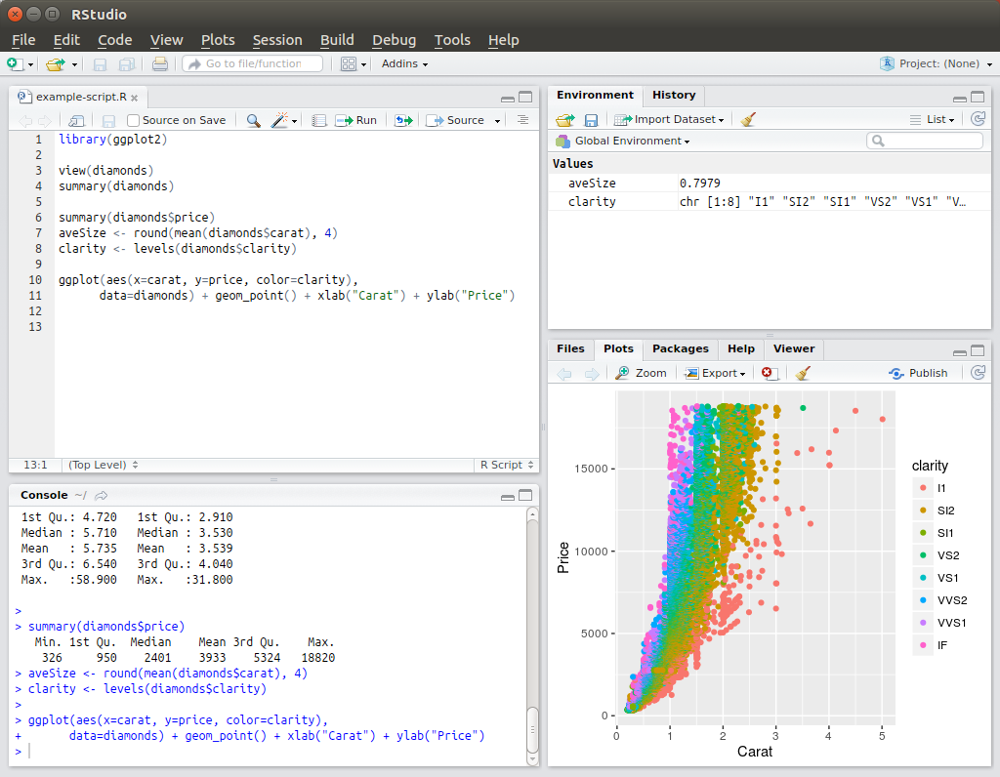
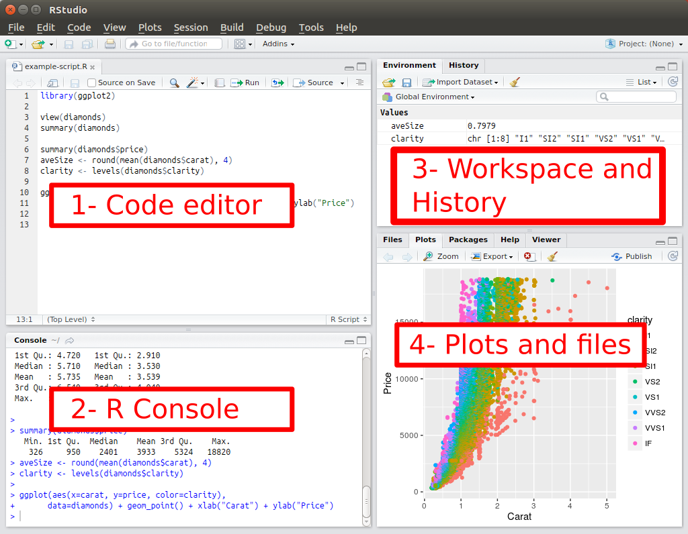

# Before we start

### IDE (Integrated Development Environment)

Today we will be using [Rstudio](https://www.rstudio.com/).

RStudio makes R easier to use. Its an IDE including a console, a syntax-highlighting code editor, and tools for 
debugging, visualization and workspace management. Importantly, it helps us documenting everything that we do.

- Editor: write R scripts
- Console: interactively type R commands and see output
- Workspace: view objects / searchable command history
- Plot pane / R package manager / Integrated R help
- Organize your scripts as projects (File | New Project...)

### Work with projects

- Under the `File` menu, click on `New project`, choose `New directory`, then `Empty project`
- Enter a name for this new folder, and choose a convenient location for it. This will be your **working directory** for the rest of the day (e.g. `~/R_course`)
- Click on `Create project`
- Under the `Files` tab on the right of the screen, click on `New Folder` and create a folder named `data` within your newly created working directory. (e.g. `~/R_course/data)
- Create a new R script (File > New File > R script) and save it in your working directory (e.g. `R-course-script.R`)

### Why R?

- open source software under GPL  
- widely used both in academia and industry
- available on all platforms
- not just for statistics, but also general purpose programming

### Getting help

- use Google (e.g. with an error message)
- If you know the name of the function, you can use the built-in help: `?round`
- If the function is part of a package that is installed on your computer but don’t remember which one, you can type: `??kruskal` 
- search the R package documentation <https://www.rdocumentation.org/>

## Installation Instructions

For this course we will use Rstudio and R (any version). You can get R from https://cran.r-project.org/index.html and 
Rstudio from https://www.rstudio.com/products/rstudio/download/
