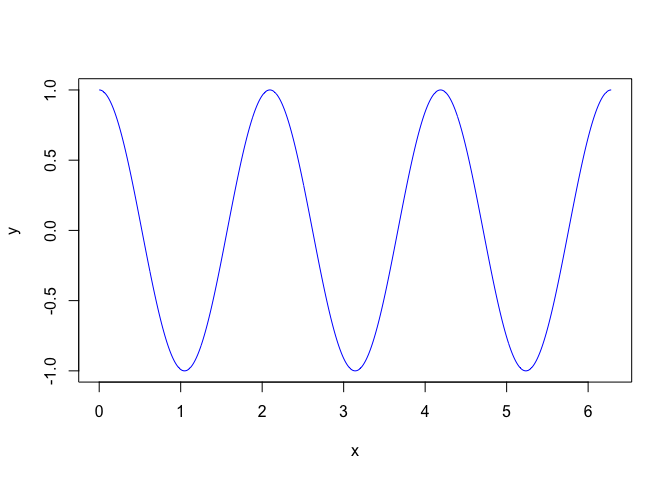

My first simple Rmd file
========================

Don't forget to install knitr package.

    install.packages("knitr")

Introduction
============

This is an `.Rmd` document. Maybe you have heard of `Sweave`? Well,
`knitr` is like modern `Sweave`.

-   can work with markdown files (simpler) and LaTeX.
-   more flexible re: graphics
-   caching
-   fancy look and feel.

A simple example
----------------

Let's get R to do some simple maths.

    x <- 1:3
    y <- 4:6
    outer(x, y)

    ##      [,1] [,2] [,3]
    ## [1,]    4    5    6
    ## [2,]    8   10   12
    ## [3,]   12   15   18

As well as having chunks in separate paragaphs, you can have some inline
computation. For example, the mean of x is 2 and the sum of x and y is
5, 7, 9. Chunks can be named and then referred to later.

Plotting is easy too
--------------------

    x <- seq(from=0, to=2*pi, length=1000)
    y <- cos(3*x)
    plot(x, y, type='l', col='blue')

Tables
------

See also the [xtable](http://cran.r-project.org/web/packages/xtable/)
package.

    library(knitr)
    kable(head(iris[,1:3]), format='html')

<table>
 <thead>
  <tr>
   <th style="text-align:right;"> 
Sepal.Length
</th>
   <th style="text-align:right;"> 
Sepal.Width
</th>
   <th style="text-align:right;"> 
Petal.Length
</th>
  </tr>
 </thead>
<tbody>
  <tr>
   <td style="text-align:right;"> 
5.1
</td>
   <td style="text-align:right;"> 
3.5
</td>
   <td style="text-align:right;"> 
1.4
</td>
  </tr>
  <tr>
   <td style="text-align:right;"> 
4.9
</td>
   <td style="text-align:right;"> 
3.0
</td>
   <td style="text-align:right;"> 
1.4
</td>
  </tr>
  <tr>
   <td style="text-align:right;"> 
4.7
</td>
   <td style="text-align:right;"> 
3.2
</td>
   <td style="text-align:right;"> 
1.3
</td>
  </tr>
  <tr>
   <td style="text-align:right;"> 
4.6
</td>
   <td style="text-align:right;"> 
3.1
</td>
   <td style="text-align:right;"> 
1.5
</td>
  </tr>
  <tr>
   <td style="text-align:right;"> 
5.0
</td>
   <td style="text-align:right;"> 
3.6
</td>
   <td style="text-align:right;"> 
1.4
</td>
  </tr>
  <tr>
   <td style="text-align:right;"> 
5.4
</td>
   <td style="text-align:right;"> 
3.9
</td>
   <td style="text-align:right;"> 
1.7
</td>
  </tr>
</tbody>
</table>

Okay, what do you need to know?
===============================

1.  What is markdown syntax? Orignally
    [here](http://daringfireball.net/projects/markdown), promoted for
    `R` by [Rstudio](http://rmarkdown.rstudio.com/).

2.  What can `knitr` do? [Knitr home page](http://yihui.name/knitr/)
