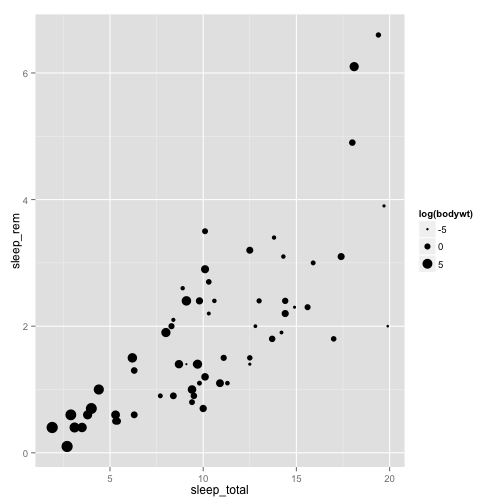
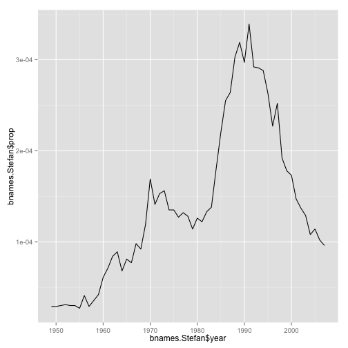

# Programming Exercises

We want to practice what we have learned so far. 

Work in the Rstudio editor and write a script that also serves as documentation. Try to write clean code (readable and as simple as possible):

* use consistent variable names (e.g. PropBlond or Prop_Blond) 
* indent your code
* write functions

***

Before starting let's install the `ggplot2` package:


```r
install.packages("ggplot2")
```

Load the `ggplot2` package as we will use some of its data: 


```r
library(ggplot2)
```

```
## Loading required package: methods
```


***

# Data Set 1: Sleep in mammals

The msleep data set is part of the `ggplot2` package. It contains a mammals sleep dataset (see ?msleep for details).

First let's first look at the structure of the dataset:


```r
str(msleep)
```

```
## 'data.frame':	83 obs. of  11 variables:
##  $ name        : chr  "Cheetah" "Owl monkey" "Mountain beaver" "Greater short-tailed shrew" ...
##  $ genus       : chr  "Acinonyx" "Aotus" "Aplodontia" "Blarina" ...
##  $ vore        : Factor w/ 4 levels "carni","herbi",..: 1 4 2 4 2 2 1 NA 1 2 ...
##  $ order       : chr  "Carnivora" "Primates" "Rodentia" "Soricomorpha" ...
##  $ conservation: Factor w/ 7 levels "","cd","domesticated",..: 5 NA 6 5 3 NA 7 NA 3 5 ...
##  $ sleep_total : num  12.1 17 14.4 14.9 4 14.4 8.7 7 10.1 3 ...
##  $ sleep_rem   : num  NA 1.8 2.4 2.3 0.7 2.2 1.4 NA 2.9 NA ...
##  $ sleep_cycle : num  NA NA NA 0.133 0.667 ...
##  $ awake       : num  11.9 7 9.6 9.1 20 9.6 15.3 17 13.9 21 ...
##  $ brainwt     : num  NA 0.0155 NA 0.00029 0.423 NA NA NA 0.07 0.0982 ...
##  $ bodywt      : num  50 0.48 1.35 0.019 600 ...
```


### 1. Which mammal sleeps the least, the most?

```r
msleep[which.min(msleep$sleep_total), ]
```

```
##       name   genus  vore        order conservation sleep_total sleep_rem
## 30 Giraffe Giraffa herbi Artiodactyla           cd         1.9       0.4
##    sleep_cycle awake brainwt  bodywt
## 30          NA  22.1      NA 899.995
```

```r
msleep[which.max(msleep$sleep_total), ]
```

```
##                name  genus    vore      order conservation sleep_total
## 43 Little brown bat Myotis insecti Chiroptera         <NA>        19.9
##    sleep_rem sleep_cycle awake brainwt bodywt
## 43         2         0.2   4.1 0.00025   0.01
```

### 2. Is there a association between total sleep duration and body weight (bodywt)?  

Visualize and test the correlation. What if you use the brain weight (brainwt) instead of the body weight? 


```r
qplot(data=msleep, log(bodywt), log(sleep_total))
```

 

```r
qplot(data=msleep, log(brainwt), log(sleep_total))
```

```
## Warning: Removed 27 rows containing missing values (geom_point).
```

 

```r
with(msleep, cor(log(bodywt), log(sleep_total), method = "spearman"))
```

```
## [1] -0.5346017
```

```r
with(msleep, cor.test(log(bodywt), log(sleep_total), method = "spearman"))
```

```
## Warning in cor.test.default(log(bodywt), log(sleep_total), method =
## "spearman"): Cannot compute exact p-value with ties
```

```
## 
## 	Spearman's rank correlation rho
## 
## data:  log(bodywt) and log(sleep_total)
## S = 146223, p-value = 1.931e-07
## alternative hypothesis: true rho is not equal to 0
## sample estimates:
##        rho 
## -0.5346017
```

### 3. Make a scatterplot of sleep_total vs. sleep_rem

```r
qplot(data=msleep, sleep_total, sleep_rem)
```

```
## Warning: Removed 22 rows containing missing values (geom_point).
```

 

### 4. Make point size proportional to log(body mass)

```r
qplot(data=msleep, sleep_total, sleep_rem, size=log(bodywt))
```

```
## Warning: Removed 22 rows containing missing values (geom_point).
```

 

### 5. Add a OLS (Ordinary least square) regression line

```r
qplot(data=msleep, sleep_total, sleep_rem, size=log(bodywt)) + stat_smooth(method = 'lm')
```

```
## Warning: Removed 22 rows containing missing values (stat_smooth).
```

```
## Warning: Removed 22 rows containing missing values (geom_point).
```

 

### 6. Color-code the points according to vore. Does the scaling of REM & total sleep differ with diet?

```r
#type of vores in the dataset
table(msleep$vore)
```

```
## 
##   carni   herbi insecti    omni 
##      19      32       5      20
```

```r
qplot(data=msleep, sleep_total, sleep_rem, size=log(bodywt), col=vore) + stat_smooth(se=FALSE, method='lm')
```

```
## Warning: Removed 9 rows containing missing values (stat_smooth).
```

```
## Warning: Removed 8 rows containing missing values (stat_smooth).
```

```
## Warning: Removed 1 rows containing missing values (stat_smooth).
```

```
## Warning: Removed 2 rows containing missing values (stat_smooth).
```

```
## Warning: Removed 2 rows containing missing values (stat_smooth).
```

```
## Warning: Removed 22 rows containing missing values (geom_point).
```

 

### (advanced) 7. Make the figure from the question 6 in publication quality (Axes labels, font sizes, ..)

```r
qplot(data=msleep, sleep_total, sleep_rem, col=vore, size=3, shape=vore) + xlab("Total amount of sleep (hrs/day)") + ylab("REM sleep (hrs/day)") + theme_classic(base_size = 14, base_family = "Helvetica") + scale_shape(name = "Functional\nfeeding group", labels = c("carnivore","herbivore","insectivore","omnivore")) + guides(size = FALSE, col = FALSE)
```

```
## Warning: Removed 27 rows containing missing values (geom_point).
```

 
The graph is still not perfect, e.g. as the legend is small and not colored. But often it is faster and more convenient to do make small changes manually using graphics software. Here I would save the plot as svg and make the last improvements using Inkscape (or Illustrator on svg or pdf).


Original publication in [PNAS](http://www.pnas.org/content/104/3/1051.abstract)

****

## Data Set 2: Baby names

(Data set 1 is borrowed from a [lecture](http://stat405.had.co.nz/lectures/11-adv-data-manip.pdf) by Hadley Wickham)

The data set contains the top 1000 male and female baby names in the US, from
1880 to 2008 (1000* 2 * 129 = 258,000 records). All names with more than 5 uses
are given.

It contains 5 variables: year, name, soundex, sex and proportion

Download bnames2.csv.bz2 from http://stat405.had.co.nz/data/bnames2.csv.bz2
(Under Windows download the zipped file [bnames2.csv.zip](bnames2.csv.zip) and extract it before reading)

You can directly read in the compressed file like (on Linux and Mac OS)

```r
bnames <- read.csv("bnames2.csv.bz2")
```

Also load a file containing the total number of birth per years (for boys and girls separately)

```r
births <- read.csv("http://stat405.had.co.nz/data/births.csv")
```


Now it's your turn.
### 1. Extract your name from the dataset. Plot the trend over time.


```r
head(bnames)
```

```
##   year    name     prop sex soundex
## 1 1880    John 0.081541 boy    J500
## 2 1880 William 0.080511 boy    W450
## 3 1880   James 0.050057 boy    J520
## 4 1880 Charles 0.045167 boy    C642
## 5 1880  George 0.043292 boy    G620
## 6 1880   Frank 0.027380 boy    F652
```


Plotting the frequency of Stefan from 1880 to 2008.


```r
bnames.Stefan <- subset(bnames, name=="Stefan")
plot(bnames.Stefan$year, bnames.Stefan$prop, type="l")
```

 

```r
qplot(bnames.Stefan$year, bnames.Stefan$prop, geom="line")
```

 

Robbie is an example for a name that was used both for boys and girls. qplot adds a legend automatically.

```r
qplot(year, prop, color=sex, data=subset(bnames, name=="Robbie"), geom="line")
```

 


### 2. Use the soundex variable to extract all names that sound like yours. Plot the trend over time.

```r
#All names sounding like Stefan with soundex=="S315"
unique(subset(bnames, soundex=="S315")$name)
```

```
##  [1] Stephen   Steven    Stephan   Stevan    Stefan    Stephon   Stephanie
##  [8] Stephania Stefanie  Stephenie Stefani   Stephany  Stephaine Stephani 
## 6782 Levels: Aaden Aaliyah Aarav Aaron Ab Abagail Abb Abbey ... Zula
```

```r
qplot(year, prop, color=sex, data=subset(bnames, soundex=="S315"), geom="line") + facet_wrap(~ name)
```

 

```r
#We can also have different scales for each panel
qplot(year, prop, color=sex, data=subset(bnames, soundex=="S315"), geom="line") + facet_wrap(~ name, scales = "free")
```

 

### 3. Find out the most frequently used similar sounding name

```r
head(sort(decreasing = TRUE, table(subset(bnames, soundex=="S315")$name)))
```

```
## 
##    Steven   Stephen Stephanie   Stephan    Stefan  Stefanie 
##       134       129       121        74        58        40
```

```r
qplot(year, prop, color=name, data=subset(bnames, name %in% c("Steven","Stefan","Stephan")), geom="line") + scale_y_log10()
```

 

### (advanced) 4. Which boy and girl name was used most over the whole time? 

We need to sum up the absolute births over the years. First we add a variable AbsBirths

```r
AbsNumber <- vector(length = nrow(bnames))
for (i in 1:nrow(bnames)) { 
  totalNumber <- subset(births, year == bnames$year[i] & sex == bnames$sex[i])$births
  AbsNumber[i] <- round(bnames$prop[i] * totalNumber)
}
bnames$AbsBirths <- AbsNumber
```

Then we sum up AbsBirths

```r
counts <- tapply(bnames$AbsBirths, bnames$name, sum)
head(counts)
```

```
##   Aaden Aaliyah   Aarav   Aaron      Ab Abagail 
##     959   39665     219  509464      25    2682
```

```r
head(sort(decreasing = TRUE, counts))
```

```
##   James    John  Robert Michael    Mary William 
## 5043259 5036828 4771447 4226596 4111514 3966170
```

Alternatively we could use the ddply() function:

```r
library(plyr)
counts2 <- ddply(bnames, "name", summarize, n = sum(AbsBirths))
```

A quick check

```r
counts["Stefan"]
```

```
## Stefan 
##  16180
```

```r
sum(subset(bnames, name == "Stefan")$AbsBirths)
```

```
## [1] 16180
```

### (advanced) 5. Did first names became shorter over time? 
bnames$length <- nchar(bnames$name)
bnames.1880ies <- subset(bnames, year >= 1880 & year < 1890)
sum.1880 <- sum(tapply(bnames.1880ies$AbsBirths, bnames.1880ies$length, sum))
tapply(bnames.1880ies$AbsBirths, bnames.1880ies$length, sum)/sum.1880*100
bnames.1990ies <- subset(bnames, year >= 1990 & year < 2000)
sum.1990 <- sum(tapply(bnames.1990ies$AbsBirths, bnames.1990ies$length, sum))
tapply(bnames.1990ies$AbsBirths, bnames.1990ies$length, sum)/sum.1990*100

Calculating it for all years is a bit more tricky as we need a weighted eman and can't use tapply. Either we do it with a for loop or we can use the `ddply()` function from the `plyr` package. See also this [Stackoverflow post](http://stackoverflow.com/questions/18392408/how-to-use-ddply-to-get-weighted-mean-of-class-in-dataframe)


```r
bnames.girls <- subset(bnames, sex=="girl")[, c(1,6,7)]
```

```
## Error in `[.data.frame`(subset(bnames, sex == "girl"), , c(1, 6, 7)): undefined columns selected
```

```r
plot(ddply(bnames.girls, .(year), summarize, x = weighted.mean(length, AbsBirths)), type='l', ylab="Mean Length")
```

```
## Error in plot(ddply(bnames.girls, .(year), summarize, x = weighted.mean(length, : konnte Funktion "ddply" nicht finden
```

```r
bnames.boys <- subset(bnames, sex=="boy")[, c(1,6,7)]
```

```
## Error in `[.data.frame`(subset(bnames, sex == "boy"), , c(1, 6, 7)): undefined columns selected
```

```r
lines(col="red", ddply(bnames.boys, .(year), summarize, x = weighted.mean(length, AbsBirths)))
```

```
## Error in lines(col = "red", ddply(bnames.boys, .(year), summarize, x = weighted.mean(length, : konnte Funktion "ddply" nicht finden
```

First names have become longer in the US over time. Interestingly, girls' names (in black) are more variable in length than boys' names (in red). 

### (advanced) 6. Which names became very rare after 1944? 


```r
bnames.before1944 <- subset(bnames, year < 1944)
counts.before1944 <- tapply(bnames.before1944$AbsBirths, bnames.before1944$name, sum)

bnames.from1944 <- subset(bnames, year >= 1944)
counts.from1944 <- tapply(bnames.from1944$AbsBirths, bnames.from1944$name, sum)
bnames.from1944$rank <- nrow(bnames.from1944) + 1 -rank(bnames.from1944$prop)
#Merge into 2 data frame
bnames.counts <- merge(as.data.frame(counts.before1944), as.data.frame(counts.from1944), all=TRUE, by="row.names")
bnames.counts$rank.before1944 <- nrow(bnames.counts) + 1 - rank(bnames.counts$counts.before1944, na.last = "keep")
bnames.counts$rank.from1944 <- rank(bnames.counts$counts.from1944, na.last = "keep")
#RankProduct
bnames.counts$RankProd <- bnames.counts$rank.before1944 * bnames.counts$rank.from1944
head(bnames.counts[order(decreasing = FALSE, bnames.counts$RankProd), 1:3])
```

```
##      Row.names counts.before1944 counts.from1944
## 490       Arlo              2104              43
## 2354    Farris               676              43
## 4579   Marshal               366              43
## 2789   Haskell              2541              44
## 4180 Llewellyn              1470              46
## 1963    Earlie               896              46
```

```r
#Names becoming popular only from 1944
head(bnames.counts[order(decreasing = TRUE, bnames.counts$RankProd), 1:3])
```

```
##      Row.names counts.before1944 counts.from1944
## 5664      Ryan                10          850573
## 2216      Erin                 9          307579
## 1189     Chase                 5          108247
## 1808     Diego                 5           69650
## 1353      Cody                24          266989
## 6385     Tyler                38          532129
```

### (advanced) 7. Think of another questions you could answer with the dataset. E.g. Identify the most popular firstname in 1980ies the or identify the most popular name that was used for boys and girls.

***

## Data Set 3: Hair and Eye Color

The next data set is the distribution of hair and eye color and sex in 592 statistics students stored in the table `HairEyeColor` (see ?HairEyeColor for details).

We load the data set with the data() function and have a look at the structure using str().


```r
data("HairEyeColor")
str(HairEyeColor)
```

```
##  table [1:4, 1:4, 1:2] 32 53 10 3 11 50 10 30 10 25 ...
##  - attr(*, "dimnames")=List of 3
##   ..$ Hair: chr [1:4] "Black" "Brown" "Red" "Blond"
##   ..$ Eye : chr [1:4] "Brown" "Blue" "Hazel" "Green"
##   ..$ Sex : chr [1:2] "Male" "Female"
```


```r
mosaicplot(HairEyeColor)
```

 

***

# Data Set 4: Movie ratings

The movies data set is from the `ggplot2` package. The internet movie database,
[http://imdb.com/](http://imdb.com/), is a website devoted to collecting movie
data supplied by studios and fans (See ?movies for details). 

The data set contains data for 58'788 movies, namely the title of the movie,
year of release, budget, length, rating and genre.

### 1. Look at the structure of `movies` using function str() or head(). Make a histogram of the rating.

```r
str(movies)
```

```
## 'data.frame':	58788 obs. of  24 variables:
##  $ title      : chr  "$" "$1000 a Touchdown" "$21 a Day Once a Month" "$40,000" ...
##  $ year       : int  1971 1939 1941 1996 1975 2000 2002 2002 1987 1917 ...
##  $ length     : int  121 71 7 70 71 91 93 25 97 61 ...
##  $ budget     : int  NA NA NA NA NA NA NA NA NA NA ...
##  $ rating     : num  6.4 6 8.2 8.2 3.4 4.3 5.3 6.7 6.6 6 ...
##  $ votes      : int  348 20 5 6 17 45 200 24 18 51 ...
##  $ r1         : num  4.5 0 0 14.5 24.5 4.5 4.5 4.5 4.5 4.5 ...
##  $ r2         : num  4.5 14.5 0 0 4.5 4.5 0 4.5 4.5 0 ...
##  $ r3         : num  4.5 4.5 0 0 0 4.5 4.5 4.5 4.5 4.5 ...
##  $ r4         : num  4.5 24.5 0 0 14.5 14.5 4.5 4.5 0 4.5 ...
##  $ r5         : num  14.5 14.5 0 0 14.5 14.5 24.5 4.5 0 4.5 ...
##  $ r6         : num  24.5 14.5 24.5 0 4.5 14.5 24.5 14.5 0 44.5 ...
##  $ r7         : num  24.5 14.5 0 0 0 4.5 14.5 14.5 34.5 14.5 ...
##  $ r8         : num  14.5 4.5 44.5 0 0 4.5 4.5 14.5 14.5 4.5 ...
##  $ r9         : num  4.5 4.5 24.5 34.5 0 14.5 4.5 4.5 4.5 4.5 ...
##  $ r10        : num  4.5 14.5 24.5 45.5 24.5 14.5 14.5 14.5 24.5 4.5 ...
##  $ mpaa       : Factor w/ 5 levels "","NC-17","PG",..: 1 1 1 1 1 1 5 1 1 1 ...
##  $ Action     : int  0 0 0 0 0 0 1 0 0 0 ...
##  $ Animation  : int  0 0 1 0 0 0 0 0 0 0 ...
##  $ Comedy     : int  1 1 0 1 0 0 0 0 0 0 ...
##  $ Drama      : int  1 0 0 0 0 1 1 0 1 0 ...
##  $ Documentary: int  0 0 0 0 0 0 0 1 0 0 ...
##  $ Romance    : int  0 0 0 0 0 0 0 0 0 0 ...
##  $ Short      : int  0 0 1 0 0 0 0 1 0 0 ...
```

```r
hist(movies$rating)
```

 

### 2. Do old movies perform better or worse than recent movies?

```r
boxplot(movies$rating ~ movies$year)
```

 
Some movies obtained less than 10 votes. Remove them and repeat the plotting. Do you see a change? 

### . Does the movie genre influence the rating? 

```r
movies$Genre.simple <- ifelse(movies$Action == 1, "Action", ifelse(movies$Comedy == 1, "Comedy", ifelse(movies$Drama == 1, "Drama", "other")))
movies.conf <- subset(movies, votes >= 10)
boxplot(movies.conf$rating ~ movies.conf$Genre.simple)
```

 

By default genres are alphabetically ordered. Let's order the genres according to their median rating (tip: use factors and function factor()). 

```r
movies$Genre.simple <- factor(movies$Genre.simple, levels = c("Action","other","Comedy","Drama"))
boxplot(movies.conf$rating ~ movies.conf$Genre.simple)
```

 

### . Which movie is the longest and how long is it?

```r
movies.conf[which.max(movies.conf$length), ]
```

```
##                        title year length budget rating votes   r1  r2  r3
## 11937 Cure for Insomnia, The 1987   5220     NA    3.8    59 44.5 4.5 4.5
##        r4 r5 r6 r7  r8  r9  r10 mpaa Action Animation Comedy Drama
## 11937 4.5  0  0  0 4.5 4.5 44.5           0         0      0     0
##       Documentary Romance Short Genre.simple
## 11937           0       0     0        other
```

### . Does the movie length have an impact on its rating?
Tip: use the function cut to make categories.

```r
boxplot(movies.conf$rating ~  cut(movies.conf$length, breaks = quantile(movies.conf$length)))
```

 

```r
#movies.conf.clean <- subset(movies.conf, length <= 300)
#boxplot(movies.conf.clean$rating ~ cut(movies.conf.clean$length, breaks = 10), las=3)
#But beware of categories with few members!
#tapply(movies.conf.clean$rating, cut(movies.conf.clean$length, breaks = 10), length)
```


sumd <- aggregate(awake ~ conservation, data=msleep, FUN=mean)
sumd$sd <- aggregate(awake ~ conservation, data=msleep, FUN=sd)[,2]
limits <- aes(ymax = awake + sd, ymin = awake - sd)
dyp <- ggplot(sumd, aes(x=conservation, y=awake)) + geom_bar(fill="grey") + theme_classic()
dyp + geom_errorbar(limits, width=0.25)

## Tables 

See also the [xtable](http://cran.r-project.org/web/packages/xtable/)
package.


```r
library(knitr)
kable(head(iris[,1:3]), format='html')
```

<table>
 <thead>
  <tr>
   <th style="text-align:right;"> Sepal.Length </th>
   <th style="text-align:right;"> Sepal.Width </th>
   <th style="text-align:right;"> Petal.Length </th>
  </tr>
 </thead>
<tbody>
  <tr>
   <td style="text-align:right;"> 5.1 </td>
   <td style="text-align:right;"> 3.5 </td>
   <td style="text-align:right;"> 1.4 </td>
  </tr>
  <tr>
   <td style="text-align:right;"> 4.9 </td>
   <td style="text-align:right;"> 3.0 </td>
   <td style="text-align:right;"> 1.4 </td>
  </tr>
  <tr>
   <td style="text-align:right;"> 4.7 </td>
   <td style="text-align:right;"> 3.2 </td>
   <td style="text-align:right;"> 1.3 </td>
  </tr>
  <tr>
   <td style="text-align:right;"> 4.6 </td>
   <td style="text-align:right;"> 3.1 </td>
   <td style="text-align:right;"> 1.5 </td>
  </tr>
  <tr>
   <td style="text-align:right;"> 5.0 </td>
   <td style="text-align:right;"> 3.6 </td>
   <td style="text-align:right;"> 1.4 </td>
  </tr>
  <tr>
   <td style="text-align:right;"> 5.4 </td>
   <td style="text-align:right;"> 3.9 </td>
   <td style="text-align:right;"> 1.7 </td>
  </tr>
</tbody>
</table>


