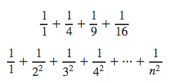

## Getting started
### Using R as a calculator

The simplest thing you could do with R is do arithmetic:

```
1 + 100
[1] 101
```
Here, we’ve added 1 and 100 together to make 101. The [1] preceding this we will explain in a minute. For now, think of it as something that indicates output.

Order of operations is the same as in maths class (from highest to lowest precedence):

Brackets  
Exponents  
Divide  
Multiply  
Add  
Subtract  
  
</b>  
</b>   
   
What will this evaluate to?

```
3 + 5 * 2
```
The “caret” symbol (or “hat”) is the exponent (to-the-power-of) operator (read x ^ y as “x to the power of y”). What will this evaluate to?

```
3 + 5 * 2 ^ 2
```
Use brackets (actually parentheses) to group to force the order of evaluation if it differs from the default, or to set your own order.

```
(3 + 5) * 2
[1] 16
```
But this can get unwieldy when not needed:

```
(3 + (5 * (2 ^ 2))) # hard to read
3 + 5 * 2 ^ 2       # easier to read, once you know rules
3 + 5 * (2 ^ 2)     # if you forget some rules, this might help
```

See ?Arithmetic for more information, and two more operators (you can also get there by ?"+" (note the quotes)

If R thinks that the statement is incomplete, it will change the prompt from > to + indicating that it is expecting more input. This is not an addition sign! Press "Esc" if you want to cancel this statement and return to the prompt.

</b>  
</b> 

The usual sort of comparison operators are available:

```
1 == 1  # equality (note two equals signs, read as "is equal to")
[1] TRUE
1 != 2  # inequality (read as "is not equal to")
[1] TRUE
1 <  2  # less than
[1] TRUE
1 <= 1  # less than or equal to
[1] TRUE
1 >  0  # greater than
[1] TRUE
1 >= -9 # greater than or equal to
[1] TRUE
```
See ?Comparison for more information (you can also get there by help("==").  
</b>  
</b> 

Really small numbers get a scientific notation:

```
2/10000
[1] 2e-04
```
which you can write in too:

```
2e-04
[1] 2e-04
```
Read e-XX as “multiplied by 10^XX”, so 2e-4 is 2 * 10^(-4).


### Mathematical functions

R has many built in mathematical functions that will work as you would expect:

```
sin(1)  # trig functions
[1] 0.8415
asin(1) # inverse sin (also for cos and tan)
[1] 1.571
log(1)  # natural logarithm
[1] 0
log10(10) # base-10 logarithm
[1] 1
log2(100) # base-2 logarithm
[1] 6.644
exp(0.5) # e^(1/2)
[1] 1.649
```
Plus things like probability density functions for many common distributions, and other mathematical functions (e.g., Gamma, Beta, Bessel). If you need it, it’s probably there.

### Variables and assignment

You can assign values to variables using the assignment operator `<-`, like this:

```
x <- 1/40
```
And now the variable x contains the value 0.025:

```
x
[1] 0.025
```
(note that it does not contain the fraction 1/40, it contains a decimal approximation of this fraction. This appears exact in this case, but it is not. These decimal approximations are called “floating point numbers” and at some point you will probably end up having to learn more about them than you’d like).

Look up at the top right pane of RStudio, and you’ll see that this has appeared in the “Workspace” pane.

Our variable x can be used in place of a number in any calculation that expects a number.

```
log(x)
[1] -3.689
sin(x)
[1] 0.025
```
The right hand side of the assignment can be any valid R expression.

```
x <- 100
```
Notice that assignment does not print a value.

Notice also that variables can be reassigned (x used to contain the value 0.025 and and now it has the value 100).

It is sometimes possible to use the `=` operator for assignment, though I don't fully understand when this is allowed and when not. Most people avoid the issue by always using the arrow `<-`.

</b>  
</b> 

Assignment values can contain the variable being assigned to: What will x contain after running this?

```
x <- x + 1
```
The right hand side is fully evaluated before the assignment occurs.

</b>  
</b> 

Variable names can contain letters, numbers, underscores and periods. They cannot start with a number. They cannot contain spaces at all. Different people use different conventions for long variable names, these include

periods.between.words  
underscores_between_words  
camelCaseToSeparateWords  
  
What you use is up to you, but be consistent.

**Exercise:**

Compute the difference in years between now and the year that you started University. Divide this by the difference between now and the year when you were born. Multiply this by 100 to get the percentage of your life spent at university. Use parentheses if you need them, use assignment if you need it.

This problem is as much about thinking about formalising the ingredients of a problem as much as actually getting the syntax correct.

### Vectors

R was designed for people who do data analysis. As a result in R all data types are actually vectors (Think of vectors as containers for data, not as geometric vectors in coordinate space. More precisely, in R a vector is defined as a one-dimensional array). So the number ‘1’ is actually a vector of numbers that happens to be of length 1.

```
1
[1] 1

length(1)
[1] 1
```
To build a vector, use the c function (c stands for “concatenate” or “create”).

```
x <- c(1, 2, 40, 1234)
```
We have assigned this vector to the variable x.

```
x
[1]    1    2   40 1234

length(x)
[1] 4
```
(notice how RStudio has updated its description of x. If you click it, you’ll get an option to alter it, which is rarely what you want to do).

This is a deep piece of engineering in the design; most of R thinks quite happily in terms of vectors. If you wanted to double all the values in the vector, just multiply it by 2:

```
2 * x
[1]    2    4   80 2468
```


```
You can get the maximum value…
max(x)
[1] 1234

…minimum value…
min(x)
[1] 1

…sum…
sum(x)
[1] 1277

…mean value…
mean(x)
[1] 319.2
```
…and so on. There are huge numbers of functions that operate on vectors. It is more common that functions will work with vectors than that they won’t.

Vectors can be summed together:

```
y <- c(0.1, 0.2, 0.3, 0.4)

x + y
[1]    1.1    2.2   40.3 1234.4
```
And they can be concatenated together:

```
c(x, y)
[1]    1.0    2.0   40.0 1234.0    0.1    0.2    0.3    0.4
```
and scalars can be added to them

```
x + 0.1
[1]    1.1    2.1   40.1 1234.1
```
Be careful though: if you add/multiply together vectors that are of different lengths, but the lengths factor, R will silently “recycle” the length of the shorter one:

```
x
[1]    1    2   40 1234

x * c(-2, 2)
[1]   -2    4  -80 2468
```
(note how the first and third element have been multiplied by -2 while the second and fourth element are multiplied by 2).

If the lengths to not factor (i.e., the length of the shorter vector is not a factor of the length of the longer vector) you will get a warning, but the calculation will happen anyway:

```
x * c(-2, 0, 2)
Warning: longer object length is not a multiple of shorter object length
[1]    -2     0    80 -2468
```
This is almost never what you want. Pay attention to warnings. Note that Warnings are different to Errors. We just saw a warning, where what happened is (probably) undesirable but not fatal. You’ll get errors where what happened has been deemed unrecoverable. For example

```
x + z # fails because there is no variable z
Error: object 'z' not found
```

Just as with the scalars, as well as doing arithmetic operators we can do comparisons. This returns a new vector of TRUE and FALSE indicating which elements are less than 10:

```
x < 10
[1]  TRUE  TRUE FALSE FALSE
```

You can do vector-vector comparisons too:

```
x < y # all false as y is quite small.
[1] FALSE FALSE FALSE FALSE
```

And combined arithmetic operations with comparison operations. Both sides of the expression are fully evaluated before the comparison takes place.

```
x > 1/y
[1] FALSE FALSE  TRUE  TRUE
```

Be careful with comparisons: This compares the first element with -20, the second with 20, the third with -20 and the fourth with 20.

```
x >= c(-20, 20)
[1]  TRUE FALSE  TRUE  TRUE
```

This does nothing sensible, really, and warns you again:

```
x == c(-2, 0, 2)
Warning: longer object length is not a multiple of shorter object length
[1] FALSE FALSE FALSE FALSE
```

All the comparison operators work in fairly predictable ways:

```
x == 40
[1] FALSE FALSE  TRUE FALSE

x != 2
[1]  TRUE FALSE  TRUE  TRUE
```

Sequences are easy to make, and often useful. Integer sequences can be made with the colon operator:

```
3:10 # sequence 3, 4, ..., 10
[1]  3  4  5  6  7  8  9 10
```

Which also works backwards

```
10:3 # the reverse
[1] 10  9  8  7  6  5  4  3
```

Step in different sizes

```
seq(3, 10, by=2)
[1] 3 5 7 9

seq(3, 10, length=10)
 [1]  3.000  3.778  4.556  5.333  6.111  6.889  7.667  8.444  9.222 10.000
```
 
Now we will see the meaning of the [1] term – this indicates that you’re looking at the first element of a vector. If you make a really long vector, you’ll see new numbers:

```
seq(3, by=2, length=100)
  [1]   3   5   7   9  11  13  15  17  19  21  23  25  27  29  31  33  35
 [18]  37  39  41  43  45  47  49  51  53  55  57  59  61  63  65  67  69
 [35]  71  73  75  77  79  81  83  85  87  89  91  93  95  97  99 101 103
 [52] 105 107 109 111 113 115 117 119 121 123 125 127 129 131 133 135 137
 [69] 139 141 143 145 147 149 151 153 155 157 159 161 163 165 167 169 171
 [86] 173 175 177 179 181 183 185 187 189 191 193 195 197 199 201
```

### Exercises:

One thing you can do with sequences is you can very informally look at convergent sequences. For example, the sum of squares of the reciprocals of integers:



1. What is the sum of the first four squares?
2. What is the sum of the first 100?
3. …of the first 10,000?
4. if *x* is the answer to 3, what is the square root of 6 * *x*?


### Possible solutions

Exercise 1

```
1 + 1/4 + 1/9 + 1/16 # starting to get tedious to type
[1] 1.424
```

Exercise 2

```
squares <- (1:100)^2
sum(1/squares)
[1] 1.635
```

Exercise 3

```
sum(1 / (1:10000)^2)
[1] 1.645
```

Exercise 4

```
x <- sum(1 / (1:10000)^2)
sqrt(x * 6)
[1] 3.141
```
