# Data visualization with ggplot2


## Acknowledgements

This material is based on [DataCarpentry ggplot2 material](https://github.com/datacarpentry/datacarpentry/tree/master/lessons/R/r-ggplot2) with many modifications. 


## Review

Remember an earlier lesson where we introduced basic plotting commands using built-in data and base plotting tools. For example, we made a few plots using the famous iris dataset, which measured petal and sepal length and width for several different species of flower. To learn more about this dataset you can also run `?iris`. 


```r
# Load some data and look at the first few lines
data(iris)
head(iris)
```

```
##   Sepal.Length Sepal.Width Petal.Length Petal.Width Species
## 1          5.1         3.5          1.4         0.2  setosa
## 2          4.9         3.0          1.4         0.2  setosa
## 3          4.7         3.2          1.3         0.2  setosa
## 4          4.6         3.1          1.5         0.2  setosa
## 5          5.0         3.6          1.4         0.2  setosa
## 6          5.4         3.9          1.7         0.4  setosa
```

```r
# Make a basic scatter plot
with(iris, plot(Sepal.Length, Sepal.Width))
```

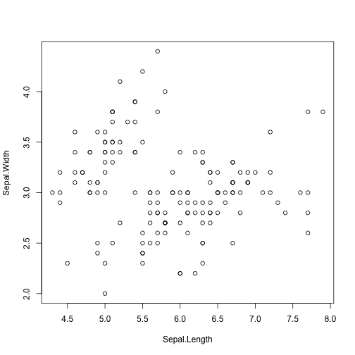 

When we call `plot` in this way, we are using built-in, or **base** graphics. R's base graphics are powerful and nearly infinitely customizable. 

## ggplot2 

We're going to be using a data visualization package called `ggplot2` for drawing the plots.

Recall how to install and load packages. Install the package if you haven't already:


```r
# Only need to do this once
install.packages("ggplot2")
```

Then load it:


```r
library(ggplot2)
```

### Plotting with ggplot2 using `qplot`

`ggplot2` is a widely used R package that extends R's visualization capabilities. It takes the hassle out of things like creating legends, mapping other variables to scales like color, or faceting plots into small multiples. We'll learn about what all these things mean shortly. To start with, let's produce the same plot as before, but this time using `ggplot2`'s `qplot` function. The `qplot` function is a quick and dirty convenience function to use **ggplot2**, and its syntax will be familiar if you're used to the base `plot` function. We'll cover advanced usage with the `ggplot` function later on.


```r
qplot(Sepal.Length, Sepal.Width, data = iris)
```

 

The syntax is very similar to R's base graphics where you specify what's on the x and y axes, then give it the name of the data frame you want to use. We see again the strong relationship between petal length and sepal length of a flower. 

#### Faceting and scaling

One option we could use is to color-code the points by their species of origin. Here, we pass another `col=` argument with the variable we'd like to use for color-coding:


```r
qplot(Sepal.Length, Sepal.Width, data = iris, col = Species)
```

 

We can see that **ggplot2** color-codes the points using a (most of the time) sensible default color scheme, and automatically draws a legend on the side for us. This requires a good deal of extra error-prone coding using base graphics.

Differentiating points by shape is also easy:


```r
qplot(Sepal.Length, Sepal.Width, data = iris, col = Species, shape = Species)
```

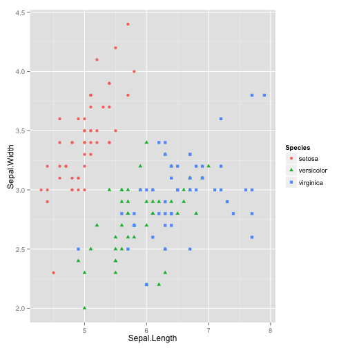 

Graphs are often easier to interpret after facetting. This can be accomplished easily using **ggplot2**:


```r
qplot(Sepal.Length, Sepal.Width, data = iris, col = Species, facets = Species ~ .)
```

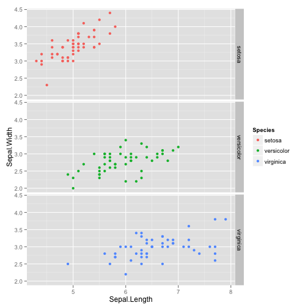 

Here, the `facets` argument expects a formula object that's constructed with the `~` operator. Here, we've plotted the sepal length vs. petal length separately for each species.

Let's assume the flowers have been collected at 5 different sites A-E coded in
the variable field.  


```r
iris$field <- rep(LETTERS[1:5], times = 30)
```

Now we can examine the sepal-petal length relationship for various fields. Here facet the plot across two different categorical variables using the same syntax:


```r
qplot(Sepal.Length, Sepal.Width, data = iris, col = field, facets = field ~ Species)
```

 

What we've done here in addition to faceting is map a feature of the data (here, the cut quality) onto a scale (here, color). This behavior will work differently depending on whether you're looking at categorical or continuous variables. We can also map features to other *scales* such as `size=`, `shape=`, `linetype=`, or even transparency using `alpha=`. All of these different scales can be combined with each other or with facets, and give you an extremely powerful and easy-to-use graphical toolbox for exploratory data analysis. 

### ggplot2 and the *Grammar of Graphics*

The **ggplot2** package provides an R implementation of Leland Wilkinson's *Grammar of Graphics* (1999). The *Grammar of Graphics* challenges data analysts to think beyond the garden variety plot types (e.g. scatter-plot, barplot) and the consider the components that make up a plot or graphic, such as how data are represented on the plot (as lines, points, etc.), how variables are mapped to coordinates or plotting shape or colour, what transformation or statistical summary is required, and so on. Specifically, **ggplot2** allows users to build a plot layer-by-layer by specifying:

 * a *geom**, which specifies how the data are represented on the plot (points, lines, bars, etc.),
 * *aesthetics* that map variables in the data to axes on the plot or to plotting size, shape, color, etc.,
 * a *stat*, a statistical transformation or summary of the data applied prior to plotting,
 * *facets*, which we've already seen above, that allow the data to be divided into chunks on the basis of other categorical or continuous variables and the same plot drawn for each chunk.

Because **ggplot2** implements a *layered* grammar of graphics, data points and additional information (scatterplot smoothers, confidence bands, etc.) can be added to the plot via additional layers, each of which utilize further geoms, aesthetics, and stats.

To make the best use of **ggplot2** it helps to understand the grammar and how it affects how plots are produced. In addition, it is important to note that **ggplot2** is not a general-purpose plotting tool-kit; you may not be able to achieve certain plots or additions to a figure of they do not map onto concepts included in the layered grammar.

In the examples above, we used **ggplot2**'s convenience function, `qplot`, because it's syntax should be familiar if you've already used base graphics. The `qplot` function did a lot of stuff for us: it created the plot object, added layers, plotted geoms, mapped features to aesthetics, created facets, and displayed the result. From here out, we'll use the `ggplot` function to build everything ourselves. 

The `ggplot` function has two required arguments: the *data* used for creating the plot, and an *aesthetic* mapping to describe how variables in said data are mapped to things we can see on the plot. Let's use `ggplot` to recreate some of the same plots we produced above. First, the simple scatterplot:


```r
# Using the qplot convenience function:
# qplot(Sepal.Length, Sepal.Width, data = iris)

# Using ggplot:
ggplot(iris, aes(Sepal.Length, Sepal.Width)) + geom_point()
```

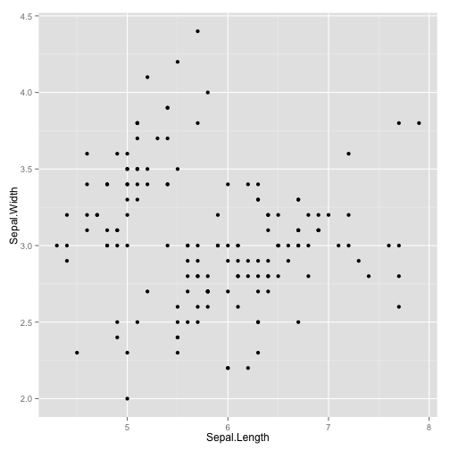 

Here, we've built our plot in layers. First, we create a canvas for plotting layers to come using the `ggplot` function, specifying which **data** to use (here, the *iris* data frame), and an **aesthetic mapping** of *Sepal.Length* to the x-axis and *Sepal.Width* to the y-axis. We next add a layer to the plot, specifying a **geom**, or a way of visually representing the aesthetic mapping. Here we're using a point. Instead of using a point, we could use a different geom. Here, let's use [hexagonal binning](http://cran.r-project.org/web/packages/hexbin/vignettes/hexagon_binning.pdf) instead of a point.


```r
ggplot(iris, aes(Sepal.Length, Sepal.Width)) + geom_hex()
```

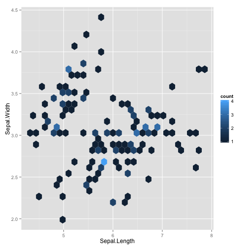 

Here, each bin represents a segment of the plotting surface with lighter blue colors representing more density in that segment. The number of bins can be adjusted as an argument to the `geom_hex()` function. This is one method of solving the overplotting problem we have in this plot without doing any faceting. Another method, here using points again, is to lower the opacity of each point. Here, `alpha=1/5` sets the opacity of each point to 20%. In other words, 5 points would have to overlap to result in a completely solid point. Note that in this case we're not *mapping* the alpha level aesthetic to some other variable as we did above with color -- we're setting it to a static value of 0.2 for all points in the layer.


```r
ggplot(iris, aes(Sepal.Length, Sepal.Width)) + geom_point(alpha=1/5)
```

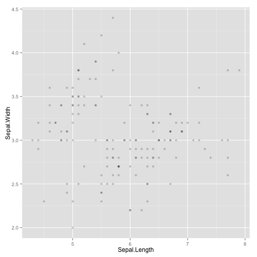 

We can easily add more layers to the plot. For instance, we could add another layer displaying a smoothed conditional mean using the `geom_smooth()` function.


```r
ggplot(iris, aes(Sepal.Length, Sepal.Width)) + geom_point() + geom_smooth()
```

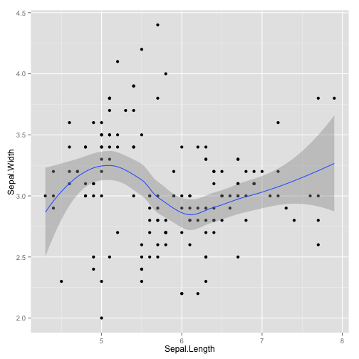 

We'll get a message telling us that because we have >1,000 observations we will default to using a generalized additive model. We could easily plot a straight line by specifying that we want a linear model (`method="lm"`) instead of a generalized additive model, the default for large datasets.


```r
ggplot(iris, aes(Sepal.Length, Sepal.Width)) + geom_point() + geom_smooth(method="lm")
```

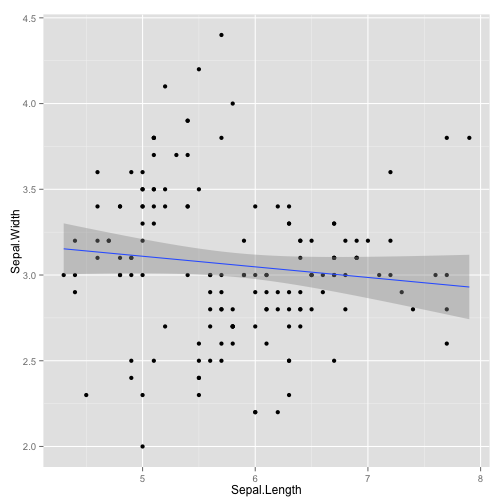 

Getting back to our examples above, using the `ggplot` syntax we can map the color of the points (an aesthetic) onto one of the variables in our dataset.


```r
# Using the qplot convenience function:
# qplot(Sepal.Length, Sepal.Width, data = iris, col = Species
# Using ggplot:
ggplot(iris, aes(Sepal.Length, Sepal.Width, col=Species)) + geom_point()
```

 

Plots can be customized, e.g. plotting bigger points or manually set colors


```r
ggplot(iris, aes(Sepal.Length, Sepal.Width, col=Species)) + geom_point(size = 3)
```

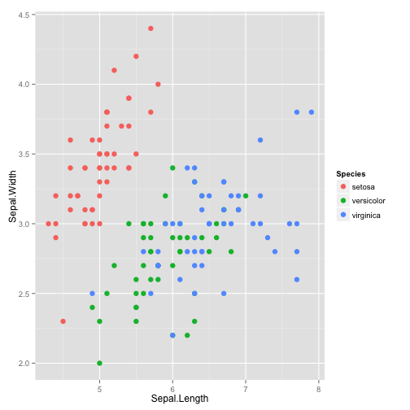 

```r
ggplot(iris, aes(Sepal.Length, Sepal.Width, col=Species)) + geom_point(size = 3) +
scale_color_manual(values = c("red", "green", "blue"))
```

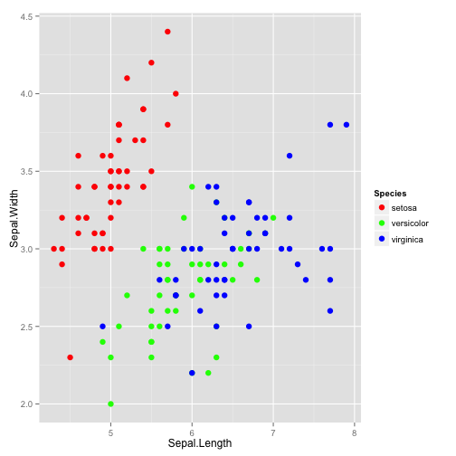 


We can also create a faceted plot as we did above using the `ggplot` function adding another layer with `facet_grid`.


```r
# Using the qplot convenience function:  
# qplot(Sepal.Length, Sepal.Width, data = iris, facets = field ~ Species)   
# Using ggplot:
ggplot(iris, aes(Sepal.Length, Sepal.Width, col=Species)) + geom_point() + facet_grid(field ~ Species)
```

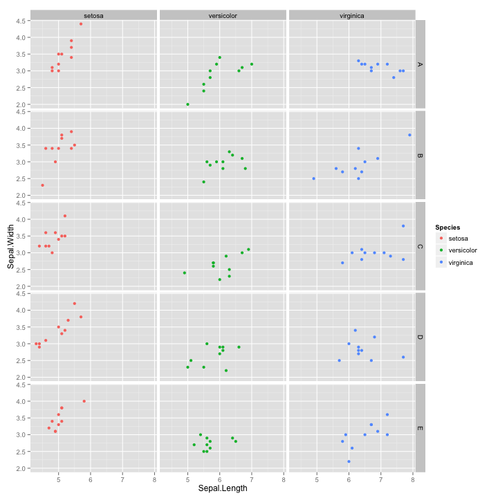 

By combining multiple layers with aesthetic mappings to different scales, **ggplot2** provides a foundation for producing a wide range of statistical graphics beyond simple "named" plots like scatter plots, histograms, bar plots, etc.

What about box plots of the sepal length grouped separately by species, color-coded by the field? Simple:


```r
ggplot(iris, aes(Species, Sepal.Length)) + geom_boxplot(aes(fill=field))
```

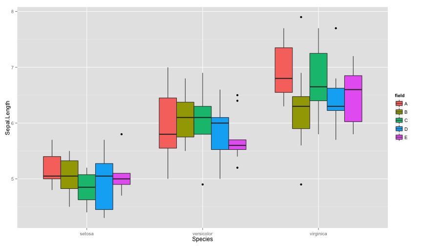 

Or what about a kernel density plot (think about a smooth histogram) of the iris's sepal length in different semitransparent curves with the color fill mapped to each *Species*, with a title and a proper axis labels? This also shows the syntax of building up a plot one step at a time. We first initialize the plot with `ggplot`, giving it the data we're working with, and aesthetic mappings. We then add a `geom_density` layer, limit the x-axis displayed, and finally give it a title and axis labels. The plot is in the **g** object here; we can simply enter `g` and the plot will be displayed.


```r
g <- ggplot(iris, aes(Sepal.Length, fill=Species)) 
g <- g + geom_density(alpha=1/4) 
g <- g + ggtitle("Sepal Length by Species")
g <- g + xlab("Sepal Length") + ylab("Density")
g
```

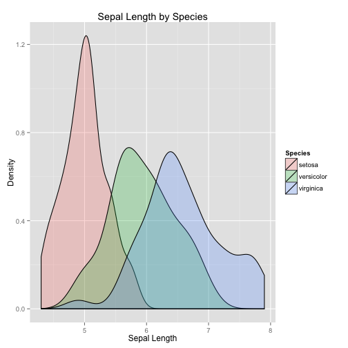 

Finally, we can save the plot created using the `ggsave` function:


```r
ggsave(filename="~/Desktop/sepal-length-density.pdf", plot=g)
```

There are endless ways to combine aesthetic mappings with different geoms and multiple layers. Read about other **geom**s, mappings, scales, and other layer options at the links below.

## Further **ggplot2** resources

* [Cheat Sheet](https://www.rstudio.com/wp-content/uploads/2015/12/ggplot2-cheatsheet-2.0.pdf)
* <http://docs.ggplot2.org/current/>: The official **ggplot2** documentation.
* <http://www.amazon.com/o/ASIN/0387981403/ref=nosim/gettgenedone-20>: The **ggplot2** book, by the developer, Hadley Wickham.
* <https://groups.google.com/forum/#!forum/ggplot2>: The **ggplot2** Google Group (mailing list, discussion forum).
* <https://github.com/swcarpentry/bc/tree/master/intermediate/r/data-visualization>: Intermediate Software Carpentry lesson on data visualization with **ggplot2**.
* <http://learnr.wordpress.com/>: A blog with a good number of posts describing how to reproduce various kind of plots using **ggplot2**.
* <http://stackoverflow.com/questions/tagged/ggplot2>: Thousands of questions and answers tagged with "ggplot2" on Stack Overflow, a programming Q&A site.
